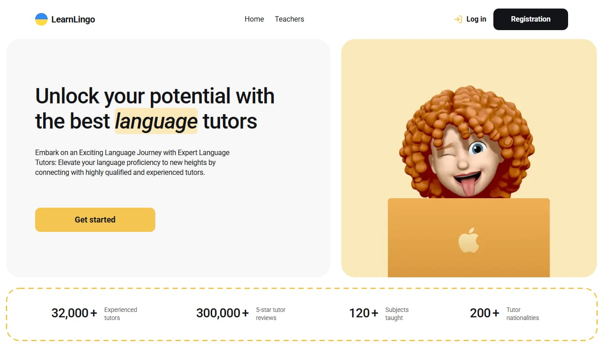
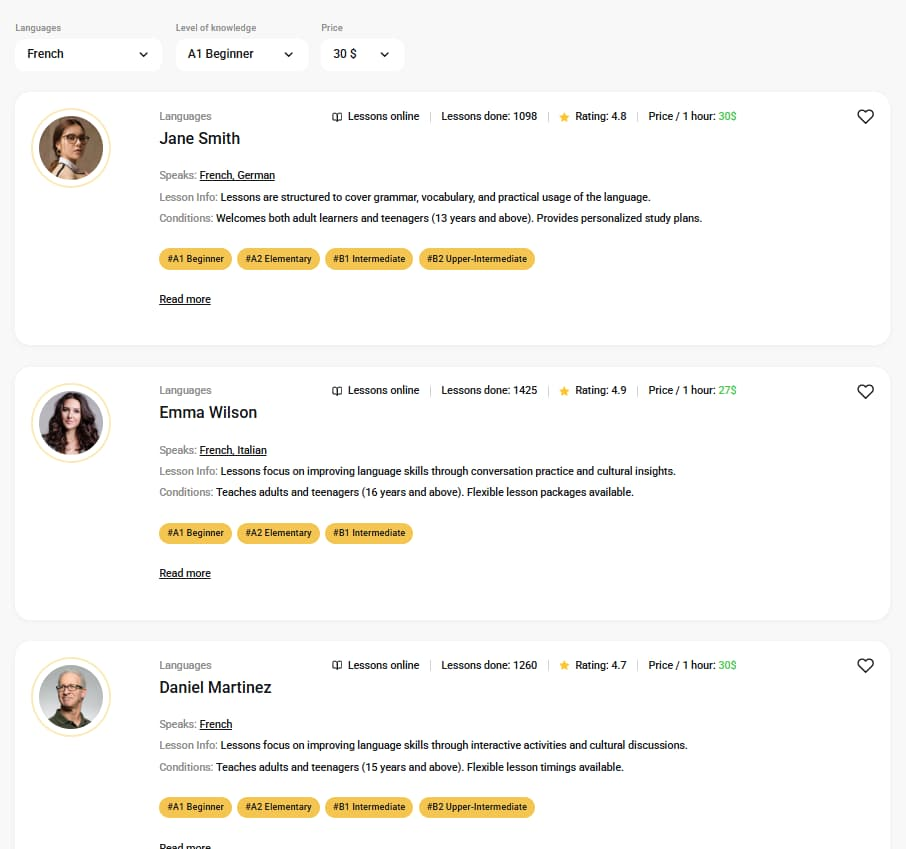

# Learn Lingo

A web application for an online language tutoring company that connects students with qualified language teachers.

## Project Description

Learn Lingo is a platform where users can browse language tutors, filter them by various criteria, add favorites, and book trial lessons. The application features user authentication, personalized favorites, and an intuitive booking system.

## 📸 Screenshots

<div align="center">
  
</div>

<div align="center">
  
</div>

## Key Features

- **Home Page**: Introduction to the platform with key statistics and benefits
- **Teachers Page**: Browse language tutors with filtering options
- **Favorites Page**: Private page for authenticated users to view saved teachers
- **User Authentication**: Registration and login system using Firebase
- **Advanced Filtering**: Filter teachers by language, knowledge level, and price
- **Favorites System**: Add/remove teachers to favorites (persisted in localStorage)
- **Booking System**: Book trial lessons through a validated form
- **Pagination**: Load more teachers with "Load more" button (4 teachers per page)
- **Responsive Modals**: Authentication, booking, and notification modals

## Technologies Used

### Core

- **React** - UI library
- **Vite** - Build tool and development server
- **React Router DOM** - Client-side routing

### State Management & Forms

- **Zustand** - Lightweight state management
- **React Hook Form** - Form handling
- **Yup** - Form validation

### Backend & Database

- **Firebase** - Backend services
  - Firebase Authentication (Email/Password)
  - Firebase Realtime Database

### Styling

- **CSS Modules** - Component-scoped styling

## Project Structure

```
src/
├── assets/          # Images and static files
├── components/      # Reusable components
│   ├── AuthRequiredModal/
│   ├── BookingModal/
│   ├── Container/
│   ├── Filters/
│   ├── Header/
│   ├── Modal/
│   ├── TeacherCard/
│   └── ...
├── context/         # React Context (AuthContext)
├── pages/           # Page components
│   ├── Home/
│   ├── Teachers/
│   └── Favorites/
├── services/        # API services
│   ├── authService.js
│   └── teachersService.js
├── stores/          # Zustand stores
│   └── useFavoritesStore.js
├── utils/           # Utilities and validation schemas
│   └── bookingSchema.js
├── firebase/        # Firebase configuration
│   └── config.js
└── App.jsx          # Main application component
```

## 🚀 Getting Started

### Prerequisites

- Node.js (v16 or higher)
- npm or yarn
- Firebase account

### Installation

1. Clone the repository:

```bash
git clone https://github.com/yourusername/learn-lingo.git
cd learn-lingo
```

2. Install dependencies:

```bash
npm install
```

3. Create a `.env` file in the root directory and add your Firebase credentials:

```env
VITE_FIREBASE_API_KEY=your_api_key
VITE_FIREBASE_AUTH_DOMAIN=your_auth_domain
VITE_FIREBASE_PROJECT_ID=your_project_id
VITE_FIREBASE_STORAGE_BUCKET=your_storage_bucket
VITE_FIREBASE_MESSAGING_SENDER_ID=your_sender_id
VITE_FIREBASE_APP_ID=your_app_id
VITE_FIREBASE_DATABASE_URL=your_database_url
```

4. Set up Firebase:

   - Create a project in [Firebase Console](https://console.firebase.google.com/)
   - Enable Email/Password authentication
   - Create a Realtime Database
   - Import teachers data to the database

5. Start the development server:

```bash
npm run dev
```

## 📦 Build for Production

```bash
npm run build
```

The built files will be in the `dist` directory.

## 🎯 Main Features Implementation

### Authentication

- User registration with email and password
- Login/logout functionality
- Protected routes for authenticated users
- Global authentication state management

### Teachers Listing

- Display teacher cards with:
  - Avatar, name, languages
  - Lessons completed, rating, price
  - Expandable details (experience, reviews, levels)
- Pagination (4 teachers per page)
- "Read more" to expand teacher details

### Filtering System

- Filter by language (English, French, German, Ukrainian, Polish)
- Filter by knowledge level (A1 to C2)
- Filter by price range
- Reset pagination when filters change

### Favorites

- Add/remove teachers from favorites (heart icon)
- Persist favorites in localStorage
- Private favorites page for authenticated users
- Authentication prompt for non-authenticated users

### Booking System

- Modal form for booking trial lessons
- Form validation (name, email, phone, reason)
- Fields: Full Name, Email, Phone Number, Learning Reason
- Success notification after booking

## Firebase Security

Make sure to set up proper Firebase security rules for your Realtime Database:

```json
{
  "rules": {
    "teachers": {
      ".read": true,
      ".write": false
    }
  }
}
```

## Browser Support

- Chrome (latest)
- Firefox (latest)
- Safari (latest)
- Edge (latest)

## 🤝 Contributing

Contributions are welcome! Please feel free to submit a Pull Request.

## License

This project is licensed under the MIT License.

## 👤 Author

Your Name - [GitHub Profile](https://github.com/NataliiaTur)

## Acknowledgments

- Design inspiration from modern education platforms
- Firebase for backend infrastructure
- React community for excellent tools and libraries
